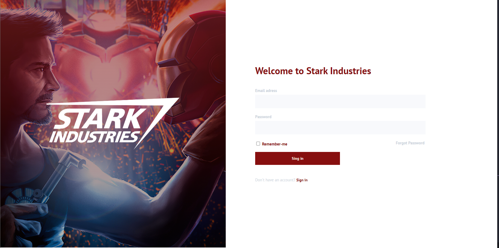

# StarkIndustries

<p align="center">
  
  <!--  -->
</p>

<p align="center">
  
  
  

  
</p>

<h1 align="center">
<!--      -->
</h1>

<br>

## ✍ Short Description

This is a project that a friend have published a figma design on linkedin and disponibilized for who wants develop

## 🧪 Technologies

This project was developed using the following technologies:

- HTML
- CSS
<!-- - JAVASCRIPT -->

<!-- ## 🚀 Getting started
Clone the project and access the folder.
```bash
git clone https://github.com/birobirobiro/my-onix-web.git
cd my-onix-web
```
Run this command to install the dependencies.
```bash
yarn install
yarn dev
``` -->

## 🔖 Layout

You can view the project through the links below:

- [Live Preview](https://stark-industries.thiagolemos.tech/)

- [Figma](https://www.figma.com/file/um92YqpfGlWiarQUpXwA8v/Sign-Up)

<!-- Remembering that you need to have a [Figma](http://figma.com/) account to access it. -->

## 🚧 Projeto:

Concluded 🙌

<!-- ## 🎨 Inspiração:
Figma: https://www.figma.com/file/2A51gQJCk5V6LxcIh2en0b/HBO-Max-Redesign-Web-App-(Community) -->

## 📝 License

This project is licensed under the MIT License. See the [LICENSE](LICENSE) file for details.

---

Made with 💙 by [Thiago Lemos](https://www.thiagolemos.tech) 👋
